# PolyMaze Architect: Multi-Algo, Multi-Topology, 3D Builder

[](https://github.com/MGriot/PolyMaze-Architect/actions/workflows/build.yml)
[](https://github.com/MGriot/PolyMaze-Architect/releases/latest)

**PolyMaze Architect** is an advanced maze generation and exploration suite. Unlike standard maze games, it allows you to architect complex structures using multiple mathematical algorithms across different grid shapes and vertical levels.

[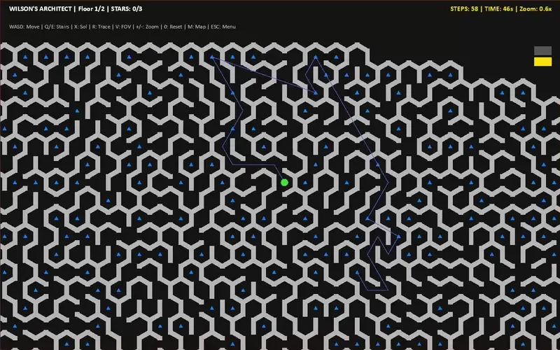](docs/video/large-hex.mp4)

## 🖼️ Screenshots

| | | |
| :---: | :---: | :---: |
| 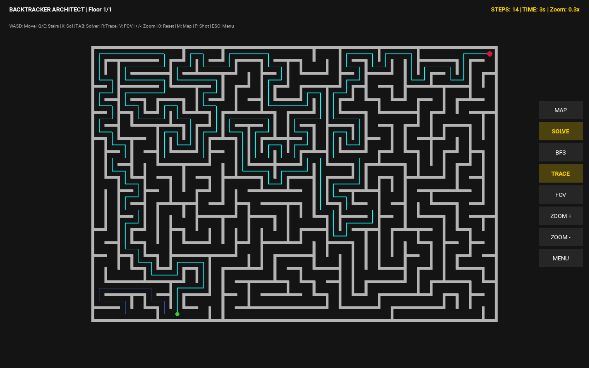 | 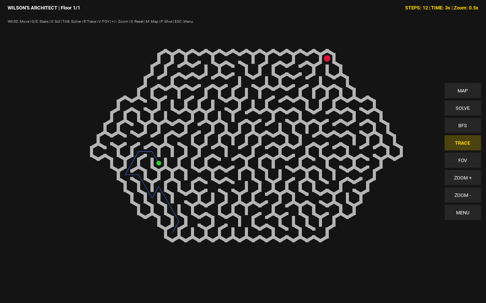 | 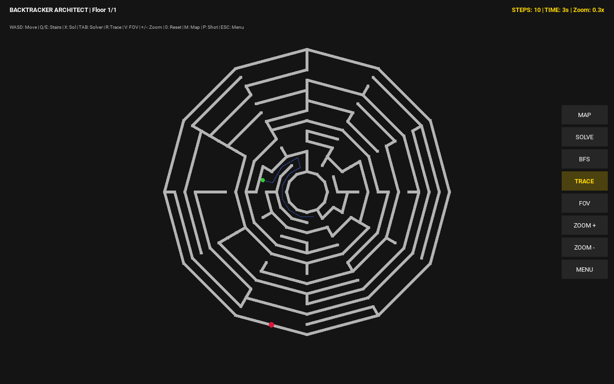 |
| Square grid, solver on | Hexagonal grid, Wilson's | Polar grid |
| 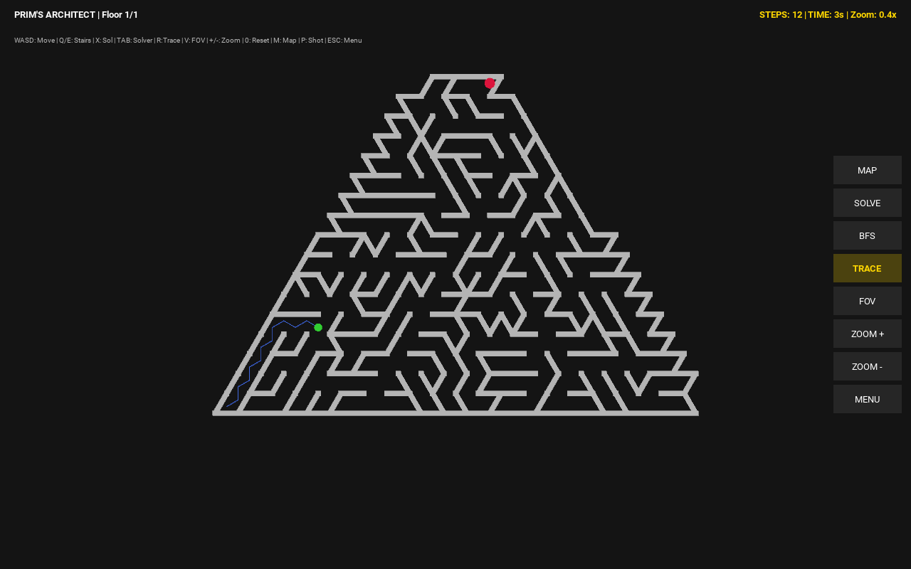 | 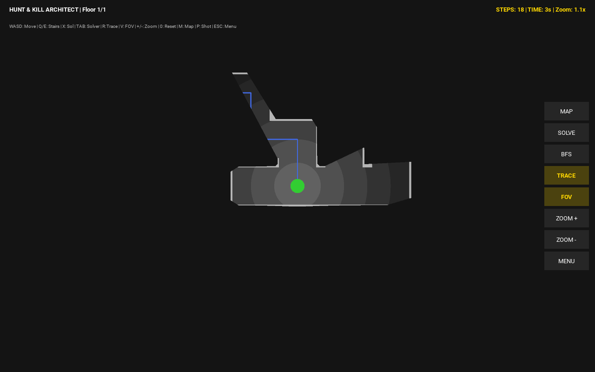 | 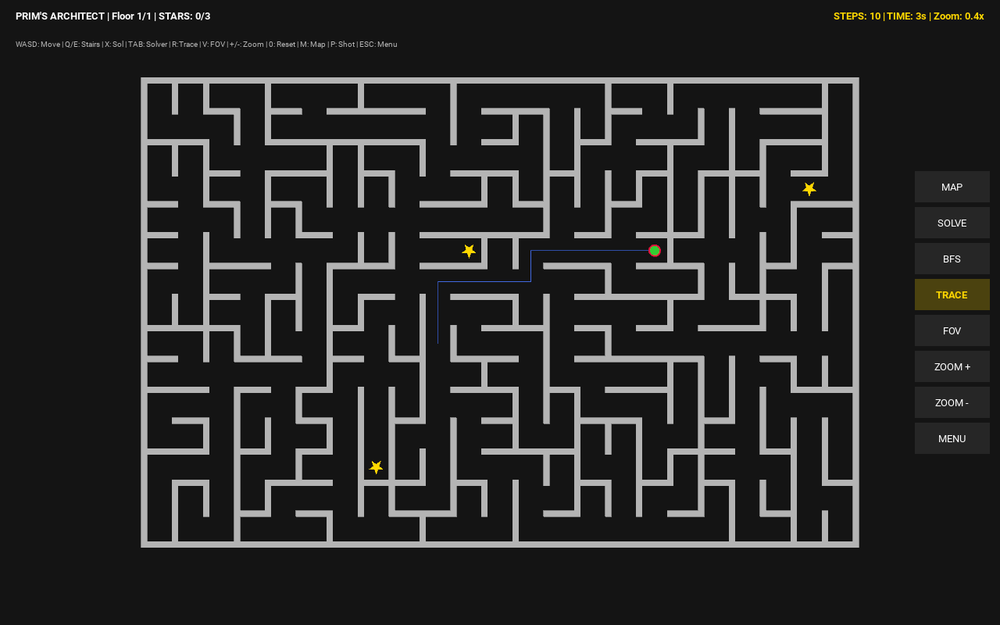 |
| Triangular grid | Dynamic FOV | Star collection |
| 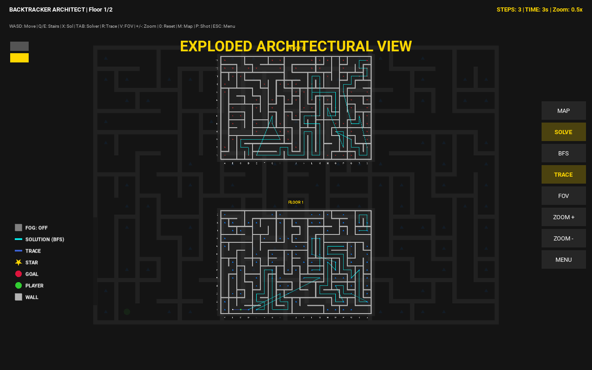 | 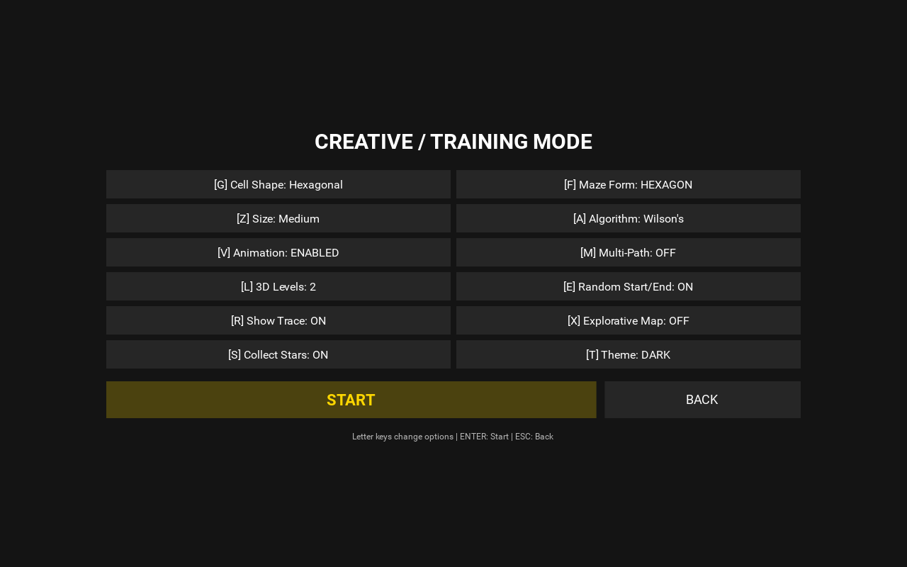 | 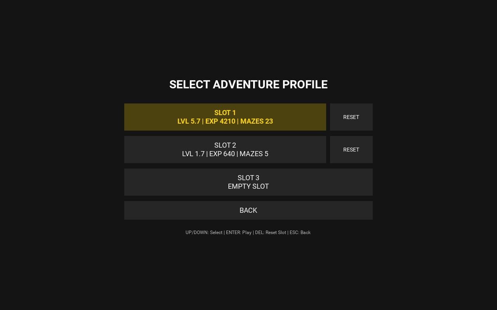 |
| Architectural map (2 floors) | Creative setup | Adventure profiles |

### 🎬 Clips

| [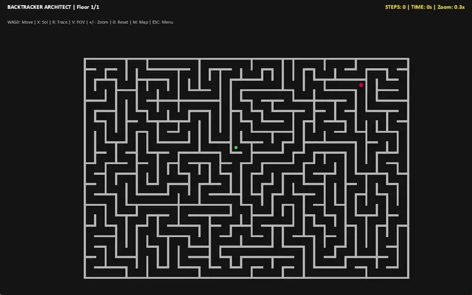](docs/video/solver.mp4) | [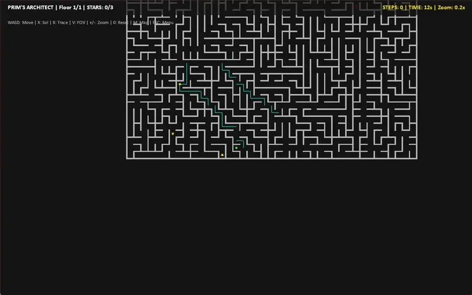](docs/video/stars.mp4) |
| :---: | :---: |
| AI solver and map ([MP4](docs/video/solver.mp4)) | Star collection ([MP4](docs/video/stars.mp4)) |

The full hex run is in [large-hex.mp4](docs/video/large-hex.mp4). The clips were recorded on the 1.x desktop build, so the menus look slightly different, but the gameplay is the same.

## 🚀 Key Features
- **Hybrid Topologies**: Architect mazes in classic **Square**, **Triangular**, **Polar**, or organic **Hexagonal** grids.
- **Adventure Mode**: Experience an **Adaptive Difficulty** system that learns from your performance and scales complexity accordingly.
- **3D Verticality**: Generate multi-level mazes (up to 6 floors) connected by functional stairs.
- **Algorithm Sandbox**: Choose from 10 generation algorithms (Wilson's, Prim's, etc.) and 3 solvers (A*, BFS, DFS).
- **Star Collection**: Optional secondary objectives that must be cleared to unlock the exit, fully integrated into the adaptive challenge model.
- **Tiered AI Solver**: Intelligent pathfinding that can calculate routes directly to the exit or optimal paths through all required stars.
- **Dynamic Lighting**: Real-time raycasted Field of View with stepped attenuation. In Adventure mode, FOV becomes a critical difficulty factor.
- **Explorative Map**: Toggle a "Fog of War" on the Architectural view to show only areas you've physically explored.
- **Architectural Overview**: Toggle an "exploded" view (`M` key) with full panning and zooming support.
- **Cross-Platform**: Built on **Kivy**: runs on Windows, macOS, Linux and **Android**, with touch controls (tap/hold/swipe to walk, pinch to zoom) alongside the classic keyboard layout.
- **High Performance**: GPU-batched wall meshes and an angle-binned raycaster keep FOV fast even on Colossal grids.
- **Themed UI**: Built-in **Dark** and **Light** modes with custom color palettes.

## 📥 Install

Download the file for your platform from the [latest release](https://github.com/MGriot/PolyMaze-Architect/releases/latest):

| Platform | File | First run |
| --- | --- | --- |
| Windows 10/11 (x64) | `PolyMazeArchitect-Setup-<version>.exe` (installer) or `PolyMazeArchitect-<version>-windows-x64-portable.zip` | The build isn't code-signed, so SmartScreen may warn: click **More info → Run anyway**. |
| macOS (Apple Silicon) | `PolyMazeArchitect-<version>-macos-arm64.dmg` | Unsigned: right-click the app → **Open** the first time. |
| Linux (x86_64) | `PolyMazeArchitect-<version>-linux-x86_64.tar.gz` | Extract and run `PolyMazeArchitect/PolyMazeArchitect`. |
| Android 7.0+ | `PolyMazeArchitect-<version>-android.apk` | Allow **Install unknown apps** for your browser or file manager. |

New versions install over the old one and keep your saves. Every release lists SHA-256 checksums in `SHA256SUMS.txt`.

Adventure profiles and screenshots are stored in your per-user data folder (`%APPDATA%\polymaze` on Windows, app-private storage on Android).

## 🛠️ Run from Source

Requires Python 3.10–3.13.

```bash
python -m venv .venv
.\.venv\Scripts\activate    # Windows
source .venv/bin/activate    # Linux/Mac
pip install -r requirements-dev.txt
python src/main.py
```

Run the test suite (core logic only; no display needed):
```bash
pytest
```

## 📦 Build Installers

See [Packaging](docs/packaging.md) for details. In short:

- **Windows**: `tools\build_windows.ps1` builds the app with PyInstaller, then the Inno Setup installer and the portable zip, all in `dist/installer/`.
- **macOS / Linux**: `pyinstaller packaging/pyinstaller/polymaze.spec --noconfirm` builds `dist/PolyMazeArchitect/`.
- **Android**: `buildozer android debug` (Linux or WSL2) builds an APK into `bin/`. Release APKs are signed with the key set up by `tools/setup_android_signing.ps1`.
- **CI**: pushing a `v*` tag builds every platform and publishes a GitHub Release with notes from the [Changelog](CHANGELOG.md).

## 📖 Documentation
For deeper insights, check out the following guides in the `/docs` folder:
- [**Adaptive Difficulty System**](docs/adaptive_difficulty.md): How Adventure mode learns from you.
- [**Maze Theory & Algorithms**](docs/theory.md): The math behind the mazes.
- [**Generation Algorithms - Trade-offs**](docs/algorithms.md): Comparative analysis of the 10 builders.
- [**Software Architecture**](docs/architecture.md): How the modular layers work.
- [**User Guide & Controls**](docs/usage.md): Comprehensive keybindings.
- [**Packaging**](docs/packaging.md): Building the desktop installers and the Android APK, signing, and releasing.
- [**Cross-Platform Roadmap**](docs/cross_platform_roadmap.md): The Kivy migration and what's next (iOS).

## 📂 Project Structure
- `src/polymaze/core/`: UI-free game logic (topology, algorithms, geometry, rules, profiles, `themes.json`).
- `src/polymaze/ui/`: Kivy frontend (screens, maze renderer, map overlay, HUD, input).
- `src/main.py`: Entry point for development, PyInstaller and Buildozer.
- `packaging/`: PyInstaller spec and Inno Setup script. `buildozer.spec` sits at the root.
- `tools/`: Asset, screenshot, Windows build and Android signing scripts.
- `tests/`: Unit tests for the core.
- `docs/`: Technical documentation, guides, screenshots (`docs/img/`) and clips (`docs/video/`).
