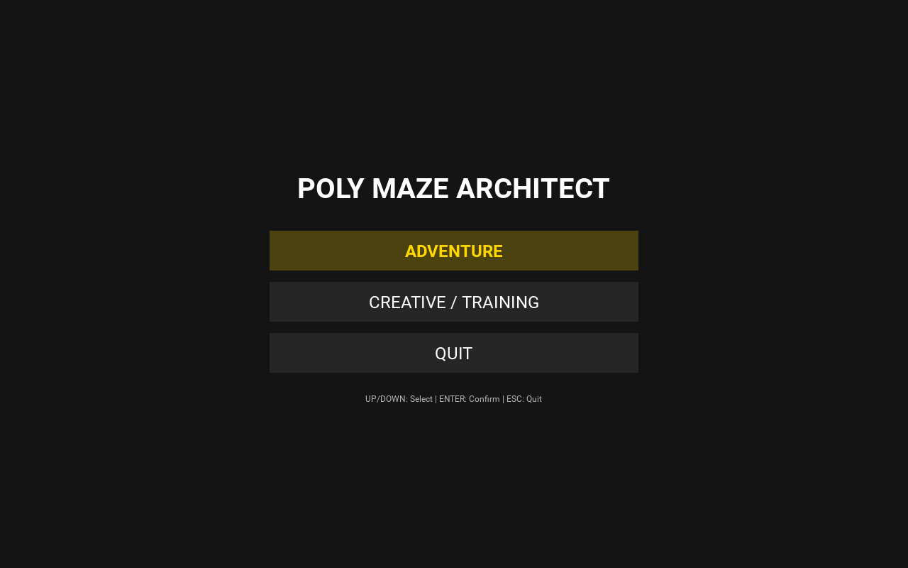

# User Guide & Controls

## Launching the Application
- **Installed build**: start *PolyMaze Architect* from the Start menu, Applications folder, or Android app drawer.
- **From source** (virtual environment active):
```bash
python src/main.py
```

Every screen works with both keyboard and touch/mouse. Menu items are buttons: tap or click them, or use **UP/DOWN** + **ENTER**.

## Main Menu


- **ADVENTURE**: Progress through an adaptive challenge. See [Adaptive Difficulty](adaptive_difficulty.md) for details.
- **CREATIVE / TRAINING**: Customize every aspect of the maze.

## Profile Selection (Adventure Mode)


- **UP/DOWN**: Select between **3 Profile Slots**.
- **ENTER**: Play with the selected profile.
- **DEL** (or the **RESET** button): Erase the selected profile, after a confirmation.
- **ESC**: Return to Main Menu.

## Creative / Training Setup


Navigate using the following keys:
- **G**: Cycle Cell Topology (**Square, Hexagonal, Triangular, Polar**).
- **F**: Cycle Maze Form (**Rectangle, Square, Diamond, Rhombus, Cross, Circle, Oval, Semicircle, Donut, Triangle, Parallelogram, Trapezoid, Kite, and N-gons: Pentagon to Decagon**).
- **Z**: Cycle Maze Size (Small, Medium, Large, X-Large, Epic, Colossal).
- **A**: Cycle Generation Algorithm (10 available).
- **L**: Set number of **3D Levels** (up to 6 floors).
- **M**: Toggle **Multi-Path** (Braided) mode.
- **V**: Toggle **Generation Animation**.
- **E**: Toggle **Random Start/End** (Randomizes both entry and exit points).
- **R**: Toggle **Trace** (Breadcrumbs).
- **X**: Toggle **Explorative Map** (Hides unvisited areas in Map view).
- **S**: Toggle **Star Collection** (Spawn 3 stars that must be collected before exit).
- **T**: Toggle **Dark/Light** theme.
- **ENTER**: Begin Architecting.
- **ESC**: Return to Main Menu.

## Exploration (In-Game)


- **WASD / Arrow Keys**: Discrete, cell-based movement with spatial alignment.
- **Q / E (or U / J)**: Move **Up (Q/U)** or **Down (E/J)** levels when standing on a Stair.
- **X**: AI Solution Animation. 
    - *1st Press*: Show path to Exit.
    - *2nd Press*: Show path to all Stars + Exit (if Stars active).
    - *3rd Press*: Clear Solution.
- **V**: Toggle **Dynamic FOV** (Creative mode only).
- **BACKSPACE**: **Reset Run**. Exits current maze (Applies XP penalty in Adventure).
- **+/-**: **Zoom In / Out** (0.1x to 3.0x).
- **0**: Reset Zoom to 1.0x.
- **TAB**: Change the AI solver algorithm (BFS, DFS, A*).
- **M**: Toggle **Architectural Map** (Vertical exploded view with coordinate helpers).
- **P**: **Print** (Save current view as PNG to the data folder).
- **ESC**: Back to Menu (Profile Select or Creative Setup).

## Architectural Map
Press **M** (or the **MAP** button) for the exploded view of every floor, with the solution, your trace, stairs and Battleship-style coordinates. With **Explorative Map** on, only the cells you have visited are shown.


## Touch Controls (Android, touchscreens, mouse)
- **Tap / hold** anywhere: walk one cell toward your finger; keep holding to keep walking.
- **Swipe**: walk in the swipe direction (works on every topology, including hex and polar).
- **Pinch** or **mouse wheel**: zoom.
- **STAIRS UP / STAIRS DOWN** buttons appear when you stand on a stair.
- **Tool column** (right edge): **MAP**, **SOLVE** (same tiers as `X`), solver name (tap to cycle, like `TAB`), **TRACE**, **FOV** (Creative only), **ZOOM +/-**, **MENU**.
- **Map view**: drag to pan, pinch/wheel to zoom.
- **Android back button**: same as **ESC**.

## Saved Data
Adventure profiles (`player_profile_<slot>.json`) and screenshots (`maze_exportNNNN.png`) live in the per-user data folder: `%APPDATA%\polymaze` on Windows, `~/Library/Application Support/polymaze` on macOS, `~/.config/polymaze` on Linux, and app-private storage on Android. Profiles from the old Arcade build (saved next to the app) are moved there automatically on first launch.

## The HUD (Heads-Up Display)
The HUD bar at the top provides real-time information:
- **Top Left**: Current generation algorithm and your floor location.
- **Top Right**: 
    - **STEPS**: Number of cells moved.
    - **TIME**: Total time spent exploring the current maze.
    - **ZOOM**: Current magnification level.

## Visual Indicators


- **Azure Triangle**: Stair leading Up.
- **Brown Triangle**: Stair leading Down.
- **Red Circle**: Goal (Exit).
- **Gold Star**: Collectible star (dimmed once collected).
- **Green Circle**: Your Avatar (Architect).
- **Thin Grey Outline**: Underlying grid structure (during generation).
- **Blue Line**: Generation progress.
- **Map Coordinates**: Battleship-style labels (A-Z for columns, 1-N for rows) to assist in spatial navigation and reference.

See also: [Packaging](packaging.md) · [Architecture](architecture.md) · [Adaptive Difficulty](adaptive_difficulty.md)
